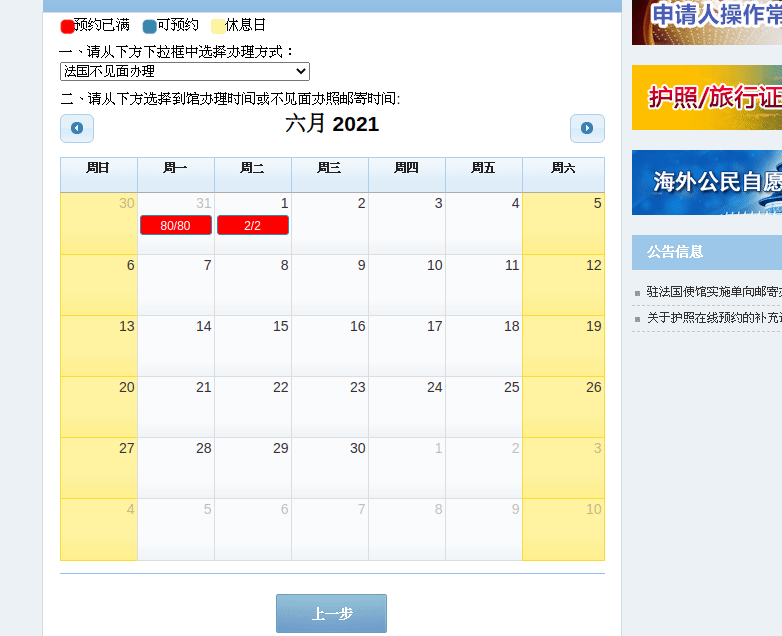

# Why?

## Problems

https://ppt.mfa.gov.cn/appo/page/reservation.html

The page is just horrible for people willing to get an appointment to renew their passport.
You have to check by yourself if a time slot gets available.
There's a bunch of steps and popups to close.
Once you get there, you basically can see that all dates are booked already.
This is not humanly possible to spend 12 hours on the computer refreshing a page.

The system is too basic and does not allow to leave a mail address to be informed when a time slot is available or even to choose to be given an appointment, any date, any time.

Also, the webpage under Firefox gives an alert that tells to use Chrome. Why ? no reason given.
Tried under Firefox and it works just fine.


## Solution

[Selenium](https://www.selenium.dev/) will be able to help us be informed as soon as an appointment is possible.
Chrome and the chromedriver for selenium will be used to browse the page.

A script will fill all you need to get to the calendar,
will check if any appointment is available (it's displayed as 35/35 for each day, 35 being the number of appointment booked/number of appointments available this day).

A mail is sent only when time slots have available appointments.

Script running as below:



# How to use

## setup on Archlinux

retrieve the following packages from AUR:

- [google-chrome](https://aur.archlinux.org/packages/google-chrome/)
- [geckodriver](https://archlinux.org/packages/community/x86_64/geckodriver/) or [chromedriver](https://aur.archlinux.org/packages/chromedriver/)

```bash
./init.sh
source venv.sh
./pip_pkgs.sh
```

Run the selenium server (and leave it running)
```bash
./start_server.sh
```

Configure the way you want:
```bash
cp app/config.py.example app/config.py
```
By default `browser="firefox"` you can use `browser="chrome"` if you prefer.

On another tab of your terminal: run the python script
```bash
source venv.sh
./start.sh
```

# THANKS

If you'd like to support me, please give a star or watch. Fill up some issues. Show some respect to me :


Address: `bc1qq3ujwjsp0lsedpjl90autue2e5uuw5mmrynmtj`
